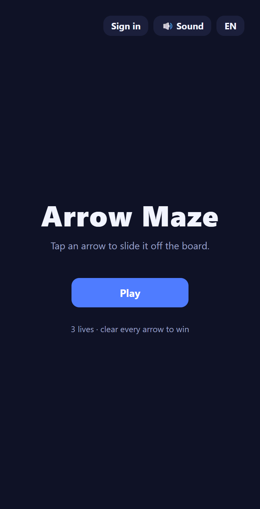
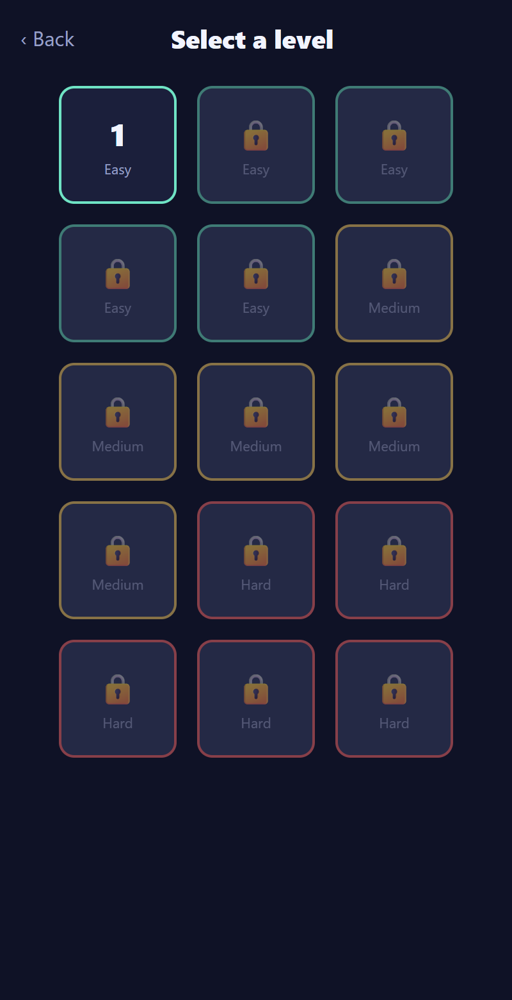
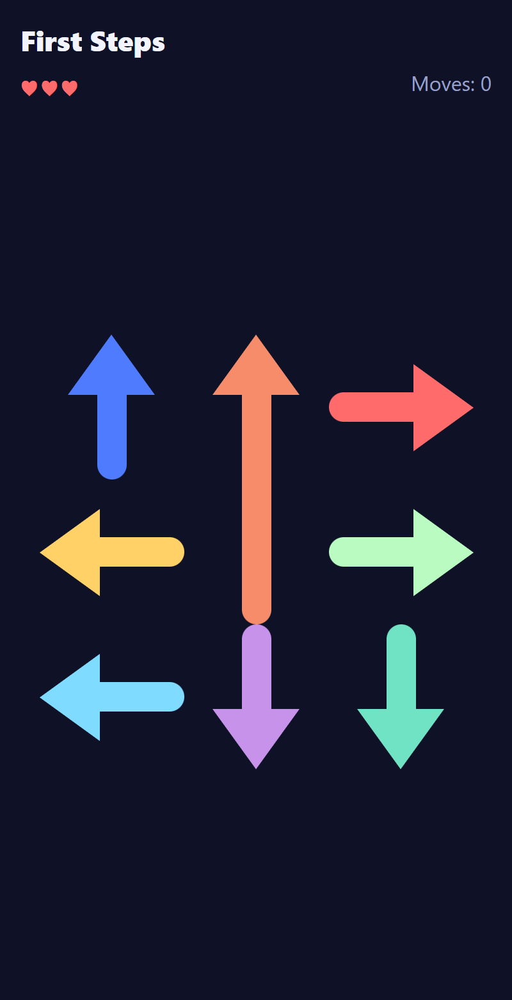
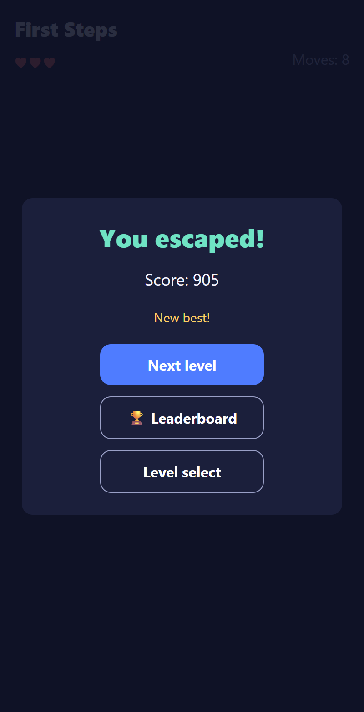
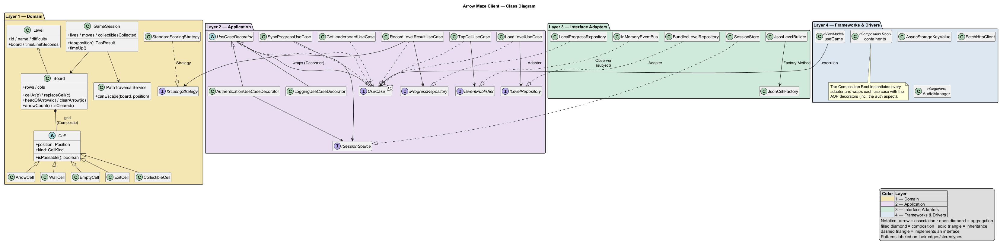

<!-- markdownlint-disable MD033 MD041 -->
<div align="center">

# 🎯 Arrow Maze — Escape Puzzle (Client)

A casual grid-puzzle game clone built with **React Native + Expo (TypeScript)**, designed around
**Clean Architecture**, **SOLID**, **GoF design patterns**, and **aspect-oriented cross-cutting concerns**.

[](https://github.com/danielsaco098/ArrowMaze-Client/actions/workflows/ci.yml)
[](#-running-tests)
[](https://expo.dev)
[](https://www.typescriptlang.org/)
[](./LICENSE)

</div>

---

## 📖 Description

**Arrow Maze** is a casual escape puzzle. The board is a grid of cells, some of which hold an **arrow**
that points in one of four directions (up, down, left, right). The player **taps an arrow to send it
sliding off the board** in the direction it points:

- If the arrow's path to the edge is **clear**, it escapes and is removed from the board.
- If the path is **blocked by another arrow cell**, the move fails and the player **loses one life**.
- The player starts with **3 lives**. Clear every arrow to **win**; run out of lives to **lose**.

Boards also contain **walls**, **empty cells** and **exit cells**, with 15 hand-authored levels of
increasing difficulty. Score is computed from **moves used** and **time elapsed**.

> **Tech stack:** React Native + Expo (SDK 56) · TypeScript (strict) · Jest + React Native Testing Library ·
> in-app i18n (ES/EN) · pluggable audio engine with mute · AsyncStorage (local persistence).

---

## 📱 Demo / Screenshots

| Home | Level Select | Gameplay | Victory |
| --- | --- | --- | --- |
|  |  |  |  |

---

## 🏛️ Architecture

The project follows **Clean Architecture** (Robert C. Martin). Dependencies always point **inward**:
outer layers know about inner layers, never the reverse. Frameworks, the database, and the UI are
**deferrable details** behind ports (interfaces).

<div align="center">


</div>

| Layer | Folder | Responsibility | Key components |
| --- | --- | --- | --- |
| **1 — Domain (Entities)** | `src/domain` | Pure business rules, zero external imports. Fully unit-testable in isolation. | `Board`, `Cell`, `ArrowCell`/`WallCell`/`EmptyCell`/`ExitCell`/`CollectibleCell`, `Level`, `GameSession` (aggregate root), `PlayerProgress`; VOs `Position`/`Direction`/`Score`/`Lives`; services `PathTraversalService`, `StandardScoringStrategy`; events `PlayerMoved`/`LevelCompleted`/`GameOver` |
| **2 — Application (Use Cases)** | `src/application` | Orchestrates the domain; depends only on **ports**, never concretions. | Use cases `TapCellUseCase`, `LoadLevelUseCase`, `RecordLevelResultUseCase`, `GetProgressUseCase`, `SyncProgressUseCase`, `GetLeaderboardUseCase`, `GetOverallLeaderboardUseCase`; AOP decorators (Logging/Metrics/ExceptionHandling/**Authentication**); ports `ILevelRepository`, `IProgressRepository`, `IEventPublisher`, `ICellFactory`, `ILevelBuilder`, `IObserver`, `IKeyValueStorage`, `IHttpClient`, `ISessionSource`, `ILogger`, `IClock`, `IMetricsRecorder`, `IAudioService` |
| **3 — Interface Adapters** | `src/adapters` | Translates between domain and frameworks. | `BundledLevelRepository`/`RestLevelRepository`, `LocalProgressRepository`, `JsonCellFactory`, `JsonLevelBuilder`, `ProgressMapper`, `InMemoryEventBus`, `AudioObserver`, `SessionStore`, `RestAuthApi`/`RestLeaderboardApi`/`RestProgressApi` |
| **4 — Frameworks & Drivers** | `src/infrastructure` | Volatile, replaceable details. | React Native UI (screens, components, `useGame` view-model hook), `AsyncStorageKeyValue`, `FetchHttpClient`, `AudioManager` + audio engine, i18n, observability (`SystemClock`/`ConsoleLogger`/`ConsoleMetricsRecorder`), **Composition Root** (`config/container.ts`) |

### Class diagram (patterns + layer colors)

<div align="center">



</div>

> Editable diagram sources (PlantUML) live in
> [`docs/diagrams/clean-architecture.puml`](./docs/diagrams/clean-architecture.puml) and
> [`docs/diagrams/class-diagram.puml`](./docs/diagrams/class-diagram.puml); the PNGs above are their
> rendered exports (any PlantUML tool re-renders them).

### Source layout

```
src/
├── domain/            # Layer 1 — pure TypeScript, no outward imports
│   ├── entities/      # Board, Cell + subtypes, GameSession, Level, PlayerProgress
│   ├── value-objects/ # Position, Direction, Score, Lives
│   ├── services/      # PathTraversalService, scoring strategy
│   └── events/        # PlayerMoved, LevelCompleted, GameOver
├── application/       # Layer 2 — use cases, ports and AOP decorators
│   ├── use-cases/
│   ├── ports/
│   └── decorators/    # Logging / Metrics / ExceptionHandling
├── adapters/          # Layer 3 — repositories, factory, builder, mappers, events
│   ├── repositories/
│   ├── factories/
│   ├── builders/
│   ├── mappers/
│   ├── events/
│   └── observers/     # AudioObserver
└── infrastructure/    # Layer 4 — frameworks & drivers
    ├── ui/            # screens, components, hooks, navigation, i18n
    ├── storage/       # AsyncStorageKeyValue
    ├── audio/         # AudioManager (singleton) + engine
    ├── observability/ # SystemClock, ConsoleLogger, ConsoleMetricsRecorder
    ├── data/          # bundled levels
    └── config/        # Composition Root (container.ts)
```

---

## 🧩 Design Patterns (GoF)

Eight GoF patterns are implemented across the three categories. Each row links to the code.

| Category | Pattern | Where / Why | Code |
| --- | --- | --- | --- |
| Creational | **Factory Method** | `JsonCellFactory` decides which concrete `Cell` (`ArrowCell`/`WallCell`/`EmptyCell`/`ExitCell`/`CollectibleCell`) to build from level data, so callers never instantiate concrete cells. | [JsonCellFactory.ts](./src/adapters/factories/JsonCellFactory.ts) |
| Creational | **Builder** | `JsonLevelBuilder` assembles a `Level` step by step from a `LevelData` definition (empty grid → place cells → board → metadata). | [JsonLevelBuilder.ts](./src/adapters/builders/JsonLevelBuilder.ts) |
| Creational | **Singleton** | `AudioManager` exposes a single shared instance (`getInstance`) that owns the global mute flag and audio engine. | [AudioManager.ts](./src/infrastructure/audio/AudioManager.ts) |
| Structural | **Composite** | `Board` holds the grid and treats every `Cell` subtype uniformly through the `Cell` base (e.g. `isPassable`). | [Board.ts](./src/domain/entities/Board.ts) |
| Structural | **Decorator** | `LoggingUseCaseDecorator` / `MetricsUseCaseDecorator` / `ExceptionHandlingUseCaseDecorator` / `AuthenticationUseCaseDecorator` / `CachingUseCaseDecorator` wrap a `UseCase` to add cross-cutting concerns (see [AOP](#-aspect-oriented-programming-aop)). | [decorators/](./src/application/decorators/UseCaseDecorator.ts) |
| Structural | **Adapter** | `LocalProgressRepository` adapts the `IKeyValueStorage` port to the `IProgressRepository` port; `AsyncStorageKeyValue` adapts React Native's AsyncStorage to `IKeyValueStorage`. | [LocalProgressRepository.ts](./src/adapters/repositories/LocalProgressRepository.ts) · [AsyncStorageKeyValue.ts](./src/infrastructure/storage/AsyncStorageKeyValue.ts) |
| Behavioral | **Strategy** | `IScoringStrategy` / `StandardScoringStrategy` make the scoring algorithm interchangeable; `BundledLevelRepository` is a swappable `ILevelRepository` strategy. | [StandardScoringStrategy.ts](./src/domain/services/StandardScoringStrategy.ts) |
| Behavioral | **Observer** | `InMemoryEventBus` (subject) notifies subscribers; `AudioObserver` reacts to `PlayerMoved`/`LevelCompleted`/`GameOver`. | [InMemoryEventBus.ts](./src/adapters/events/InMemoryEventBus.ts) · [AudioObserver.ts](./src/adapters/observers/AudioObserver.ts) |

### Representative fragments

<details>
<summary><b>Factory Method</b> — one place decides which concrete <code>Cell</code> to build</summary>

```ts
// src/adapters/factories/JsonCellFactory.ts
create(spec: CellSpec, position: Position): Cell {
  switch (spec.kind) {
    case 'ARROW': {
      const arrowId = spec.arrowId ?? deriveArrowId(position);
      const color = spec.color ?? arrowColorFor(arrowId);
      return new ArrowCell(position, Direction.fromName(spec.direction), arrowId, color, spec.segmentIndex ?? 0);
    }
    case 'WALL':        return new WallCell(position);
    case 'EMPTY':       return new EmptyCell(position);
    case 'EXIT':        return new ExitCell(position);
    case 'COLLECTIBLE': return new CollectibleCell(position);
  }
}
```
Adding the collectible power-up required only the last `case` — no caller changed.
</details>

<details>
<summary><b>Builder</b> — a level is assembled step by step from JSON data</summary>

```ts
// src/adapters/builders/JsonLevelBuilder.ts
build(data: LevelData): Level {
  const grid = this.createEmptyGrid(data.rows, data.cols);   // 1. lay out the grid
  this.placeCells(grid, data.cells, data.rows, data.cols);   // 2. place each cell
  const board = new Board(grid);                             // 3. wrap in a Board
  return new Level(data.id, data.name, data.difficulty, board, data.timeLimitSeconds);
}
```
</details>

<details>
<summary><b>Singleton</b> — one shared audio controller for the whole app</summary>

```ts
// src/infrastructure/audio/AudioManager.ts
export class AudioManager implements IAudioService {
  private static instance: AudioManager | null = null;
  private constructor() {}

  static getInstance(): AudioManager {
    if (!AudioManager.instance) {
      AudioManager.instance = new AudioManager();
    }
    return AudioManager.instance;
  }
}
```
</details>

<details>
<summary><b>Composite</b> — the board treats every cell subtype uniformly</summary>

```ts
// src/domain/entities/Board.ts — traversal never asks which subtype it holds
cells(): Cell[] {
  return this.grid.flat();
}
// src/domain/services/PathTraversalService.ts relies only on the polymorphic
// cell.isPassable() — arrows block, walls block, stars and empties let through.
```
</details>

<details>
<summary><b>Decorator</b> — cross-cutting concerns wrap any use case</summary>

```ts
// src/application/decorators/AuthenticationUseCaseDecorator.ts
async execute(input: TInput): Promise<TOutput> {
  const token = await this.sessions.getToken();
  if (!token) {
    throw new NotAuthenticatedError(this.operation);
  }
  return this.inner.execute(input); // the wrapped use case runs untouched
}
```
Stacked at the Composition Root: `withAspects(requireSession(new SyncProgressUseCase(...)))`.
</details>

<details>
<summary><b>Adapter</b> — external libraries never leak past Layer 4</summary>

```ts
// src/infrastructure/storage/AsyncStorageKeyValue.ts
export class AsyncStorageKeyValue implements IKeyValueStorage {
  getItem(key: string): Promise<string | null> {
    return AsyncStorage.getItem(key); // the only file that imports AsyncStorage
  }
}
```
</details>

<details>
<summary><b>Strategy</b> — the scoring algorithm is swappable at runtime</summary>

```ts
// src/domain/services/StandardScoringStrategy.ts
score({ moves, elapsedMs, difficulty, collectibles = 0 }: ScoreInput): Score {
  const raw = base - moves * movePenalty - seconds * timePenaltyPerSecond
            + collectibles * collectibleBonus;
  return Score.of(Math.max(minimumScore, raw));
}
// Any IScoringStrategy (e.g. a speed-run variant) plugs into RecordLevelResultUseCase.
```
</details>

<details>
<summary><b>Observer</b> — game events fan out to decoupled listeners</summary>

```ts
// src/adapters/events/InMemoryEventBus.ts
publish(event: GameEvent): void {
  for (const observer of [...this.observers]) {
    observer.notify(event); // UI, scoring and audio react without coupling
  }
}
```
</details>

---

## 🔠 SOLID Principles

Each principle is applied and traceable to concrete code.

- **S — Single Responsibility.** Tap orchestration ([`TapCellUseCase`](./src/application/use-cases/TapCellUseCase.ts)),
  the slide-out/lose-a-life rule ([`GameSession`](./src/domain/entities/GameSession.ts)) and persistence
  ([`LocalProgressRepository`](./src/adapters/repositories/LocalProgressRepository.ts)) are separate classes,
  each with one reason to change.
- **O — Open/Closed.** New cell types extend the [`Cell`](./src/domain/entities/Cell.ts) base and add one
  `case` in [`JsonCellFactory`](./src/adapters/factories/JsonCellFactory.ts); existing cells and callers stay
  untouched. Proven in practice: the collectible-star power-up landed as one new class
  ([`CollectibleCell`](./src/domain/entities/CollectibleCell.ts)) + one factory `case`, with **zero** edits to the
  other cells or the traversal. Likewise a new scoring algorithm just implements `IScoringStrategy`.
- **L — Liskov Substitution.** `ArrowCell`/`WallCell`/`EmptyCell`/`ExitCell`/`CollectibleCell` are interchangeable
  wherever a [`Cell`](./src/domain/entities/Cell.ts) is expected;
  [`PathTraversalService`](./src/domain/services/PathTraversalService.ts) relies only on the polymorphic
  `isPassable()`, so it slides arrows over stars and around walls without knowing either type.
- **I — Interface Segregation.** Concerns are split into narrow, role-specific ports
  ([`IClock`](./src/application/ports/IClock.ts), [`ILogger`](./src/application/ports/ILogger.ts),
  [`IMetricsRecorder`](./src/application/ports/IMetricsRecorder.ts), [`IKeyValueStorage`](./src/application/ports/IKeyValueStorage.ts),
  [`ISessionSource`](./src/application/ports/ISessionSource.ts)) instead of one fat interface, so each class
  depends only on what it uses.
- **D — Dependency Inversion.** Use cases depend on abstractions
  ([`ILevelRepository`](./src/application/ports/ILevelRepository.ts), `IEventPublisher`, `IScoringStrategy`,
  [`ISessionSource`](./src/application/ports/ISessionSource.ts)), never on AsyncStorage or concrete engines;
  implementations are injected at the [Composition Root](./src/infrastructure/config/container.ts).

---

## 🪡 Aspect-Oriented Programming (AOP)

Cross-cutting concerns are kept out of the domain/use-case code **without an AOP library**, using the
**Decorator pattern over a shared [`UseCase<I, O>`](./src/application/ports/UseCase.ts) port** (a SOLID-based
strategy). Each use case is wrapped at the [Composition Root](./src/infrastructure/config/container.ts):

```
GetLeaderboardUseCase
  └─ wrapped by → CachingUseCaseDecorator          (memoizes results for a TTL)
       └─ wrapped by → AuthenticationUseCaseDecorator   (verifies an active session first)
            └─ wrapped by → LoggingUseCaseDecorator          (logs input/output + duration)
                 └─ wrapped by → MetricsUseCaseDecorator          (profiles execution time)
                      └─ wrapped by → ExceptionHandlingUseCaseDecorator (centralized retry/fallback)
```

Because every use case implements the same `execute(input): Promise<output>` contract, decorators
compose transparently and the business code never references a logger, profiler, error handler, session
check or cache.

**All five aspects suggested by the brief are implemented:**

| Aspect | Decorator | What it does |
| --- | --- | --- |
| Logging & tracing | [`LoggingUseCaseDecorator`](./src/application/decorators/LoggingUseCaseDecorator.ts) | Logs entry, exit and duration of every use case — zero log calls in business code. |
| Centralized exception handling | [`ExceptionHandlingUseCaseDecorator`](./src/application/decorators/ExceptionHandlingUseCaseDecorator.ts) | Retries and fallbacks in one place; use cases just throw. |
| Performance metrics / profiling | [`MetricsUseCaseDecorator`](./src/application/decorators/MetricsUseCaseDecorator.ts) | Times each execution to spot bottlenecks without instrumenting methods. |
| Security & authorization | [`AuthenticationUseCaseDecorator`](./src/application/decorators/AuthenticationUseCaseDecorator.ts) | Automatically verifies an active session BEFORE auth-required use cases (progress sync, global leaderboard) run. |
| Result caching | [`CachingUseCaseDecorator`](./src/application/decorators/CachingUseCaseDecorator.ts) | Memoizes leaderboard queries per input for a 15s TTL, so tab switches don't re-hit the network. |

---

## 🚀 Getting Started

### Prerequisites

- **Node.js** ≥ 20 and **npm** (or pnpm/yarn)
- **Expo CLI** (`npx expo`) — no global install required
- For device testing: the **Expo Go** app, or an Android/iOS emulator

### Installation

```bash
git clone <client-repo-url> ArrowMaze-Client
cd ArrowMaze-Client
npm install
```

### Run locally

```bash
npm start          # Expo dev server (press a = Android, i = iOS, w = web)
npm run android    # build & launch on Android device/emulator
npm run ios        # build & launch on iOS simulator (macOS)
```

### Build a release (APK)

```bash
npx eas build -p android --profile preview
```

> The signed APK is published as a **GitHub Release** (deliverable #7).

---

## 🧪 Running Tests

```bash
npm test               # all unit + widget tests (Jest, two projects)
npm run test:pact      # Pact consumer-contract tests (generates pacts/*.json)
npm run test:coverage  # coverage report
npm run typecheck      # tsc --noEmit
```

- Jest runs **two projects**: `logic` (ts-jest, Node) for the framework-free domain/application layers,
  and `ui` (jest-expo) for React Native widget tests.
- **Unit tests** cover every entity, use case, and service in isolation, following **AAA**
  (Arrange–Act–Assert) and the naming convention
  `should_<expected>_when_<condition>` (e.g. `should_return_victory_state_when_the_board_is_cleared`).
  A solver test even proves all 15 bundled levels are solvable.
- **Widget tests** verify component rendering, board interaction and navigation flows
  (home → level select → game → victory, and defeat → retry) through the real `Router`.
- **Contract tests (Pact)** — [`pact/consumer.pact.test.ts`](./pact/consumer.pact.test.ts) runs the real
  REST adapters against a Pact mock provider and records the client↔backend contract into
  [`pacts/`](./pacts). The backend repo verifies that same file against the real NestJS app
  (`npm run test:pact` there), so a breaking change on either side fails CI. After changing the
  contract, regenerate here and copy the JSON to the backend's `test/pacts/`.
- Tests run automatically on every push and Pull Request via **GitHub Actions** (`.github/workflows/ci.yml`).

---

## 🤖 AI Usage Documentation

This project uses AI tooling under the transparency rules of the brief (Section 7).
See [`AI_USAGE.md`](./AI_USAGE.md) for tools used, per-task prompt logs, modifications, and critical evaluation.

---

## 🤝 Contributing

See [`CONTRIBUTING.md`](./CONTRIBUTING.md). In short:

- **Conventional Commits** in English: `feat(board): add arrow slide-out logic`
- The format is enforced locally by a **commitlint** commit-msg hook (husky) — a malformed
  message is rejected before it enters history.
- Work on feature branches → open a **Pull Request** → CI must pass → review → merge.
- `main` is protected (no direct pushes).

---

## 📄 License

Released under the [MIT License](./LICENSE).
