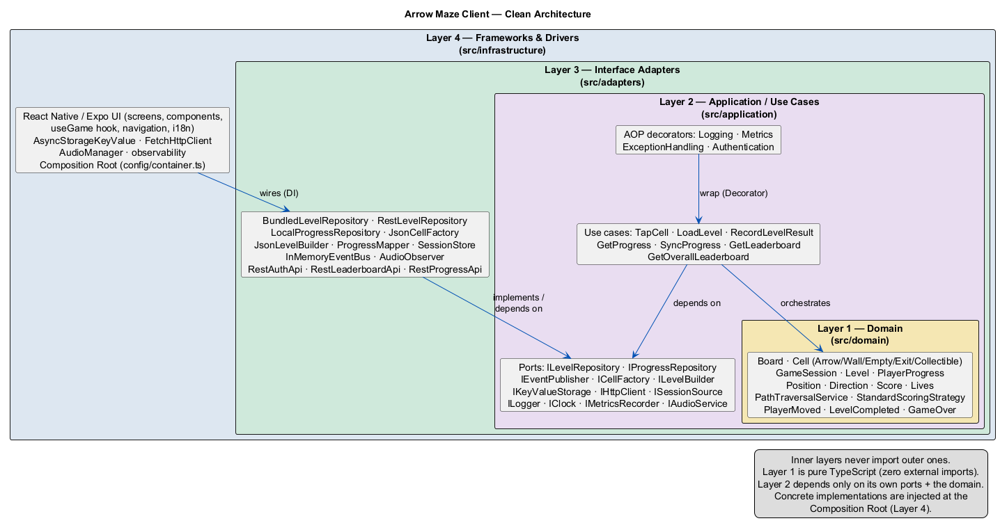

<!-- markdownlint-disable MD033 MD041 -->
<div align="center">

# 🎯 Arrow Maze — Escape Puzzle (Client)

A casual grid-puzzle game clone built with **React Native + Expo (TypeScript)**, designed around
**Clean Architecture**, **SOLID**, **GoF design patterns**, and **aspect-oriented cross-cutting concerns**.

[](https://github.com/danielsaco098/ArrowMaze-Client/actions/workflows/ci.yml)
[](#-running-tests)
[](https://expo.dev)
[](https://www.typescriptlang.org/)
[](./LICENSE)

</div>

---

## 📖 Description

**Arrow Maze** is a casual escape puzzle. The board is a grid of cells, some of which hold an **arrow**
that points in one of four directions (up, down, left, right). The player **taps an arrow to send it
sliding off the board** in the direction it points:

- If the arrow's path to the edge is **clear**, it escapes and is removed from the board.
- If the path is **blocked by another arrow cell**, the move fails and the player **loses one life**.
- The player starts with **3 lives**. Clear every arrow to **win**; run out of lives to **lose**.

Boards also contain **walls** and **empty cells**, and advanced levels add **collectibles** and a
**time limit**. Score is computed from **moves used** and **time elapsed**.

> **Tech stack:** React Native + Expo · TypeScript (strict) · Jest + React Native Testing Library ·
> i18next (ES/EN) · expo-av (audio) · AsyncStorage (local persistence) · REST sync with the
> [ArrowMaze backend](../ArrowMaze-Backend).

---

## 📱 Demo / Screenshots

> _Placeholder — replace with real captures/GIF before delivery (Section 6.1 requires this for the game repo)._

| Home | Level Select | Gameplay | Victory |
| --- | --- | --- | --- |
| _TODO_ | _TODO_ | _TODO_ | _TODO_ |

---

## 🏛️ Architecture

The project follows **Clean Architecture** (Robert C. Martin). Dependencies always point **inward**:
outer layers know about inner layers, never the reverse. Frameworks, the database, and the UI are
**deferrable details** behind ports (interfaces).

<div align="center">



</div>

| Layer | Folder | Responsibility | Key components |
| --- | --- | --- | --- |
| **1 — Domain (Entities)** | `src/domain` | Pure business rules, zero external imports. Fully unit-testable in isolation. | `Board`, `Cell`, `ArrowCell`, `WallCell`, `EmptyCell`, `ExitCell`, `Level`, `GameSession` (aggregate root), VOs `Position`/`Direction`/`Score`/`Lives`, services `PathTraversalService`/`ScoringService`, events `PlayerMoved`/`LevelCompleted`/`GameOver` |
| **2 — Application (Use Cases)** | `src/application` | Orchestrates the domain; depends only on **ports**, never concretions. | `TapCellUseCase`, `LoadLevelUseCase`, `TickUseCase`, `SaveProgressUseCase`; ports `ILevelRepository`, `IProgressRepository`, `IEventPublisher`, `ICellFactory`, `ILevelBuilder`, `IObserver` |
| **3 — Interface Adapters** | `src/adapters` | Translates between domain and frameworks. | Presenters/ViewModels, repository implementations (`Bundled`/`Rest`/`Local`), `JsonCellFactory`, `JsonLevelBuilder`, mappers (DTO ⇄ domain), `InMemoryEventBus`, AOP decorators |
| **4 — Frameworks & Drivers** | `src/infrastructure` | Volatile, replaceable details. | React Native UI (screens/widgets), AsyncStorage/SQLite, `HttpClient`, `expo-av` audio, i18next, **Composition Root** (DI wiring) |

The full **class diagram** (with patterns and layer colors) lives in
[`docs/diagrams/class-diagram.png`](./docs/diagrams/class-diagram.png).

### Planned source layout

```
src/
├── domain/            # Layer 1 — pure TypeScript, no outward imports
│   ├── entities/
│   ├── value-objects/
│   ├── services/
│   └── events/
├── application/       # Layer 2 — use cases + ports + AOP decorators
│   ├── use-cases/
│   ├── ports/
│   └── decorators/
├── adapters/          # Layer 3 — presenters, repositories, factories, mappers
│   ├── presenters/
│   ├── repositories/
│   ├── factories/
│   ├── builders/
│   ├── mappers/
│   └── events/
└── infrastructure/    # Layer 4 — RN UI, storage, http, audio, i18n, DI
    ├── ui/
    ├── storage/
    ├── http/
    ├── audio/
    ├── i18n/
    └── config/        # Composition Root
```

---

## 🧩 Design Patterns (GoF)

Patterns are distributed across the three GoF categories. _Code links are finalized as the
implementation lands._

| Category | Pattern | Where / Why | Code |
| --- | --- | --- | --- |
| Creational | **Factory Method** | `JsonCellFactory` builds `ArrowCell`/`WallCell`/`EmptyCell`/`ExitCell` from level data without the client knowing concrete classes. | `src/adapters/factories/JsonCellFactory.ts` |
| Creational | **Builder** | `JsonLevelBuilder` assembles a `Level` step by step from a JSON config (board, rules, optional elements). | `src/adapters/builders/JsonLevelBuilder.ts` |
| Creational | **Singleton** | `AudioManager`, `LevelConfigManager`, `SessionManager` — single instance per run. | `src/infrastructure/audio/AudioManager.ts` |
| Structural | **Composite** | `Board` treats groups of cells and individual `Cell`s uniformly. | `src/domain/entities/Board.ts` |
| Structural | **Decorator** | `LoggingUseCaseDecorator` / `MetricsUseCaseDecorator` / `ExceptionHandlingUseCaseDecorator` wrap use cases (see [AOP](#-aspect-oriented-programming-aop)). | `src/application/decorators/` |
| Structural | **Adapter** | Repository implementations wrap AsyncStorage / the HTTP client behind domain ports. | `src/adapters/repositories/` |
| Structural | **Facade** | `GameServiceFacade` exposes a simple API over audio + persistence + network. | `src/infrastructure/config/GameServiceFacade.ts` |
| Behavioral | **Strategy** | Interchangeable level-loading (`BundledLevelStrategy` / `RestLevelStrategy`) and scoring strategies. | `src/adapters/repositories/` |
| Behavioral | **Observer** | `InMemoryEventBus` notifies UI / scoring / audio on `PlayerMoved`, `LevelCompleted`, `GameOver`. | `src/adapters/events/InMemoryEventBus.ts` |
| Behavioral | **Command** | Each player tap is a `Command` enabling action history / undo. | `src/application/use-cases/commands/` |
| Behavioral | **State** | Game lifecycle: `MenuState`, `PlayingState`, `PausedState`, `GameOverState`, `VictoryState`. | `src/domain/entities/states/` |
| Behavioral | **Template Method** | `BaseLevel` defines the level flow (init → run → evaluate); subclasses fill specific steps. | `src/domain/entities/BaseLevel.ts` |

> ✅ Rubric needs **4+ patterns across the three categories** — this plan covers all three comfortably.

---

## 🔠 SOLID Principles

Each principle is applied and traceable to concrete code. _Paths point to the planned implementation._

- **S — Single Responsibility.** Movement (`TapCellUseCase`), rendering (RN presenters/`GameViewModel`),
  and persistence (`LocalProgressRepository`) are separate classes, each with one reason to change.
- **O — Open/Closed.** New cell types extend the `Cell`/`ICell` abstraction; adding a cell never edits
  existing cells or the factory contract.
- **L — Liskov Substitution.** `ArrowCell`, `WallCell`, `EmptyCell`, `ExitCell` are interchangeable
  anywhere an `ICell` is expected; `PathTraversalService` treats them polymorphically.
- **I — Interface Segregation.** Behaviors are split into small ports (`IRenderable`, `IInteractable`,
  `ICollidable`) instead of one fat interface, so classes depend only on what they use.
- **D — Dependency Inversion.** Use cases depend on abstractions (`ILevelRepository`, `IEventPublisher`),
  never on AsyncStorage or `fetch`; concretions are injected at the Composition Root.

---

## 🪡 Aspect-Oriented Programming (AOP)

Cross-cutting concerns are kept out of the domain/use-case code **without an AOP library**, using the
**Decorator pattern over a shared `UseCase<I, O>` port** (a SOLID-based strategy). Each use case is
wrapped at the Composition Root:

```
TapCellUseCase
  └─ wrapped by → LoggingUseCaseDecorator      (logs input/output + duration)
       └─ wrapped by → MetricsUseCaseDecorator      (profiles execution time)
            └─ wrapped by → ExceptionHandlingUseCaseDecorator (centralized retry/fallback)
```

Because every use case implements the same `execute(input): Promise<output>` contract, decorators
compose transparently and the business code never references a logger, profiler, or error handler.

**Implemented aspects:** Logging & tracing · Performance metrics · Centralized exception handling.

---

## 🚀 Getting Started

### Prerequisites

- **Node.js** ≥ 20 and **npm** (or pnpm/yarn)
- **Expo CLI** (`npx expo`) — no global install required
- For device testing: the **Expo Go** app, or an Android/iOS emulator

### Installation

```bash
git clone <client-repo-url> ArrowMaze-Client
cd ArrowMaze-Client
npm install
```

### Run locally

```bash
npm start          # Expo dev server (press a = Android, i = iOS, w = web)
npm run android    # build & launch on Android device/emulator
npm run ios        # build & launch on iOS simulator (macOS)
```

### Build a release (APK)

```bash
npx eas build -p android --profile preview
```

> The signed APK is published as a **GitHub Release** (deliverable #7).

---

## 🧪 Running Tests

```bash
npm test               # all unit + widget tests (Jest)
npm run test:watch     # watch mode
npm run test:coverage  # coverage report
```

- **Unit tests** cover every entity, use case, and service in isolation, following **AAA**
  (Arrange–Act–Assert) and the naming convention
  `should_<expected>_when_<condition>` (e.g. `should_return_victory_state_when_board_is_cleared`).
- **Widget tests** verify screen rendering and navigation (home → level → victory/defeat).
- Tests run automatically on every Pull Request via **GitHub Actions** (`.github/workflows/ci.yml`).

---

## 🤖 AI Usage Documentation

This project uses AI tooling under the transparency rules of the brief (Section 7).
See [`AI_USAGE.md`](./AI_USAGE.md) for tools used, per-task prompt logs, modifications, and critical evaluation.

---

## 🤝 Contributing

See [`CONTRIBUTING.md`](./CONTRIBUTING.md). In short:

- **Conventional Commits** in English: `feat(board): add arrow slide-out logic`
- Work on feature branches → open a **Pull Request** → CI must pass → review → merge.
- `main` is protected (no direct pushes).

---

## 📄 License

Released under the [MIT License](./LICENSE).
